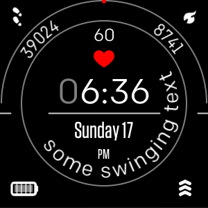

# curved-text-demo
demo clockface for fitbit-versa using multiple independant curved-text instances.
* dynamic stats (class)
* static text (animated)

This demo watchface was built for SDK 4.

As it originally was written in typescript, it needed some adjustments to support JS as well.

So currently JS is default in this project. 

To see, how to use curved-text with typescript, a index.ts.txt is included; just rename the both app/index-files and follow the instructions at app/index.ts top to remove //@ts-nocheck from the sub .ts files.

